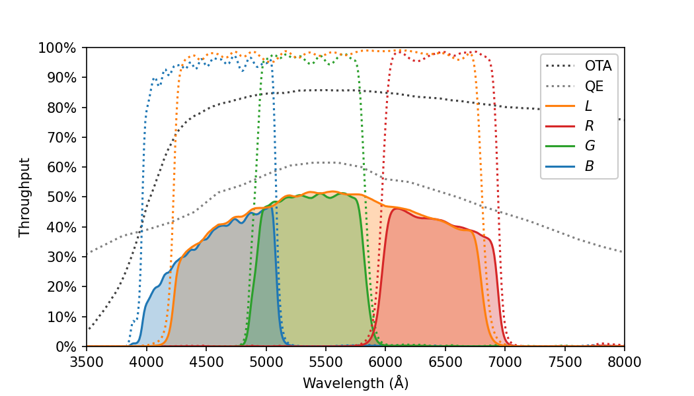

# throughput
This directory contains model throughput data for the GOTO telescopes. See `throughput.ipynb` for some examples and plots.

Data files are stored in `/data`, either as individual elements or a combined CSV file (created by `throughput.ipynb`).

## GOTO filter properties

GOTO uses a Baader LRGBC set of filters (https://www.baader-planetarium.com/en/filters/filter-sets/baader-l-rgb-c-ccd-filterset.html). C is clear glass, and is not used for observing.

The values in this table are output by  `throughput.ipynb`.

| Filter | Midpoint | Bandwidth | Throughput (no atm) | Throughput (at zenith) | Extinction coefficient |
| - | - | - | - | - | - |
| GOTO L | 5469 Å | 2536 Å | 0.4546 e-/ph | 0.3987 e-/ph | 0.143 mag |
| GOTO R | 6449 Å |  963 Å | 0.4261 e-/ph | 0.3892 e-/ph | 0.098 mag |
| GOTO G | 5371 Å |  911 Å | 0.5112 e-/ph | 0.4477 e-/ph | 0.144 mag |
| GOTO B | 4532 Å | 1066 Å | 0.3711 e-/ph | 0.3053 e-/ph | 0.212 mag |